# QuantEdge Studio: The Kinetic Ledger 🏛️

**QuantEdge Studio** is an institutional-grade quantitative research and execution terminal designed for high-conviction volatility auditing, structural pattern discovery, and ensemble strategy orchestration.

---

## 🗂️ Navigation Overview

The sidebar is organized into three sections:

| Section | Items |
|---------|-------|
| **Research** | Data Explorer · Investment Targets · Fundamentals · Research Lab · Volatility Lab · Vector Lab · Archival Report · Backtesting · Day Trading Simulator · Predictions |
| **Production** | Live Trading · Trading Journal · Market Overview |
| **Market Knowledge** | Fundamental · Technical · News |

---

## 🔬 Research

### 📊 Data Explorer
Ultra-low latency interface for auditing the raw options and equity ledgers. Connects directly to the **DuckDB** and **QuestDB** kernels for high-speed structural data verification.

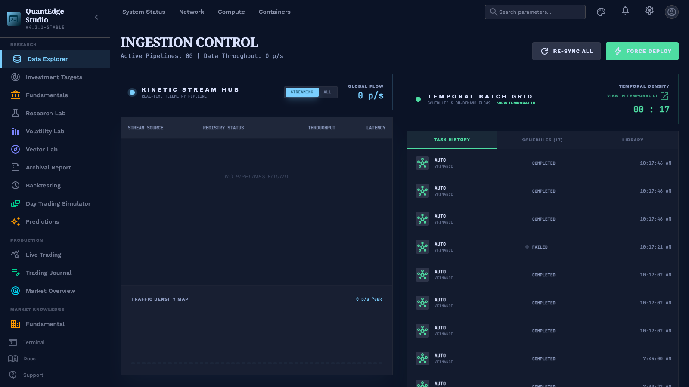

---

### 🎯 Investment Targets
The primary asset registry where institutional targets are monitored. Displays multi-dimensional metadata including market cap, P/E ratio, beta, and market sentiment. Supports adding, editing, and grouping assets by cluster.

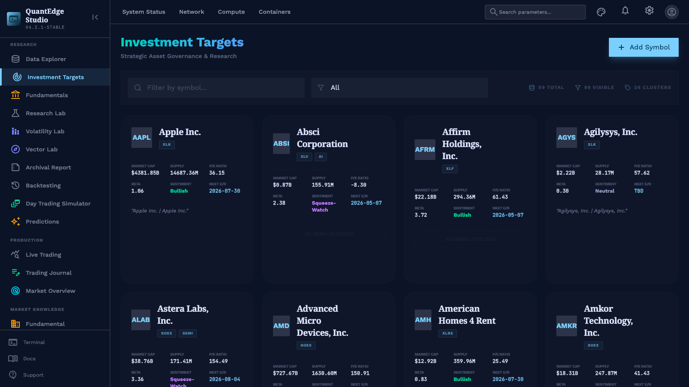

---

### 🏦 Fundamentals
Deep-dive auditing of institutional health metrics — valuation multiples, revenue trajectories, and balance sheet analytics synchronized via Yahoo Finance backfills.

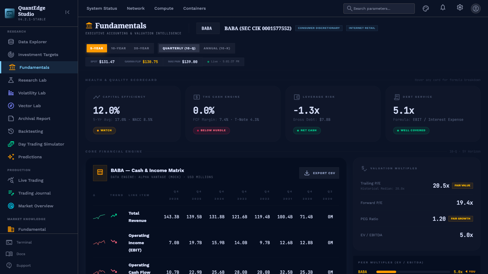

---

### 🧪 Research Lab (Structural Intelligence)
A unified workspace for structural pattern recognition and regime persistence analysis. Three tabs:

#### Pattern Detection
Runs multi-timeframe technical pattern recognition (Stage 2 Markup, VCP, Engulfing, Hurst, Rupture tuning) for any tracked symbol.

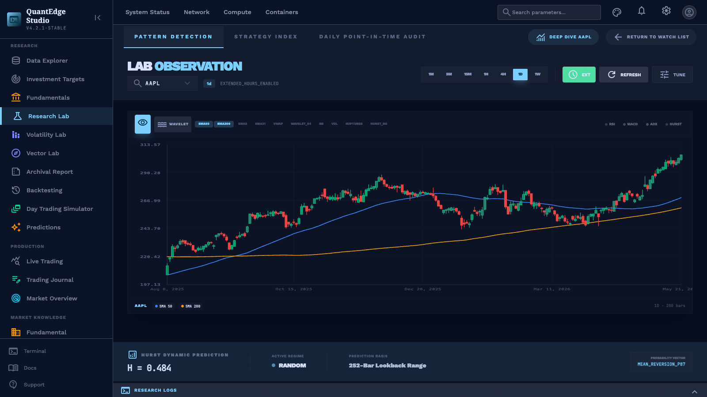

#### Strategy Index
Browse, inspect, and version-control quantitative strategy source files with a built-in code viewer.

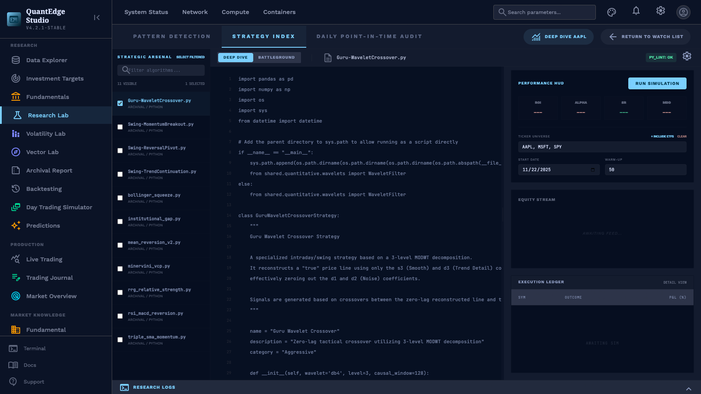

#### Daily Point-in-Time Audit
Point-in-time daily audit browser — review historical signal states across all symbols and strategies.

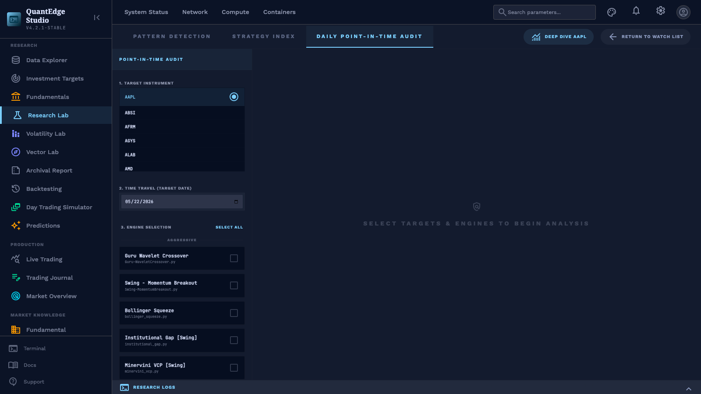

---

### 🌋 Volatility Lab (GEX Profiling)
Professional-grade **Gamma Exposure (GEX)** profiling to identify systemic liquidity clusters and market-maker positioning. Two tabs:

#### GEX Profiling
Temporal settlement ladder with Max Pain, Gamma Flip, Call/Put walls, and PCR across expiries.

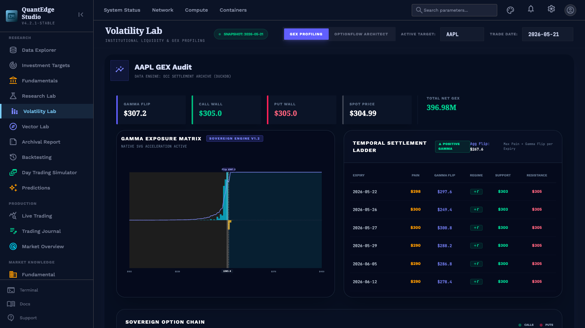

#### OptionFlow Architect
Multi-database synthesized view of unusual options flow, open interest concentration, and IV surface dynamics.

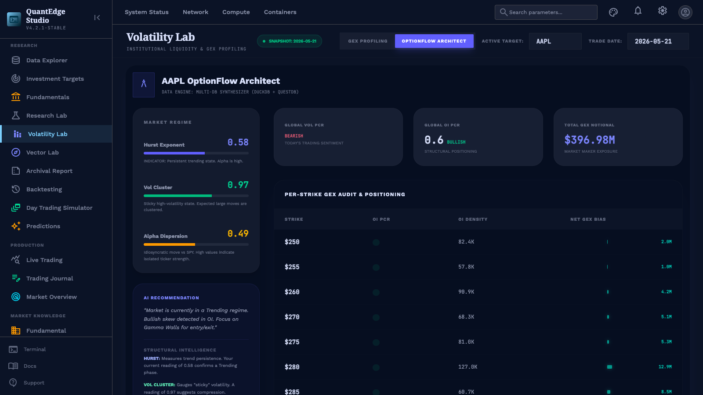

---

### 🧭 Vector Lab (Sector Rotation)
Multi-dimensional sensing of institutional capital flows through **Relative Rotation Graphs (RRG)**. Tracks assets through Leading, Weakening, Lagging, and Improving quadrants using momentum velocity vectors. Three tabs:

#### Vector Map
Animated RRG of all tracked sector ETFs vs. the SPY/QQQ baseline with time-travel playback controls.

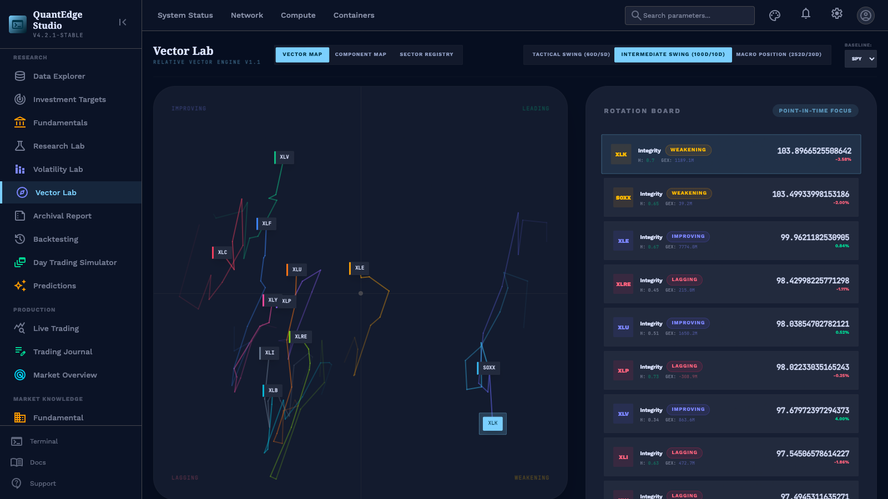

#### Component Map
Drill into a specific sector ETF (XLK, SOXX, XLY, etc.) and visualize how its constituent stocks rotate.

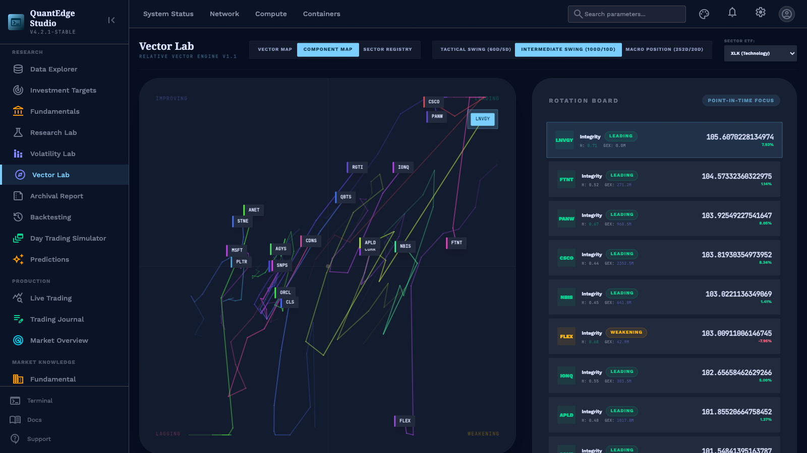

#### Sector Registry
Tabular registry linking each sector ETF to its constituent watchlist targets with Hurst and GEX metadata.

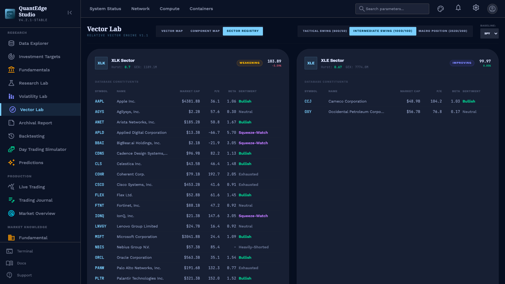

---

### 📂 Archival Report
The "Ledger of Record" for all historical pattern audits and strategy recommendations. Provides a serialized, point-in-time view of institutional intelligence for retroactive performance reviews.

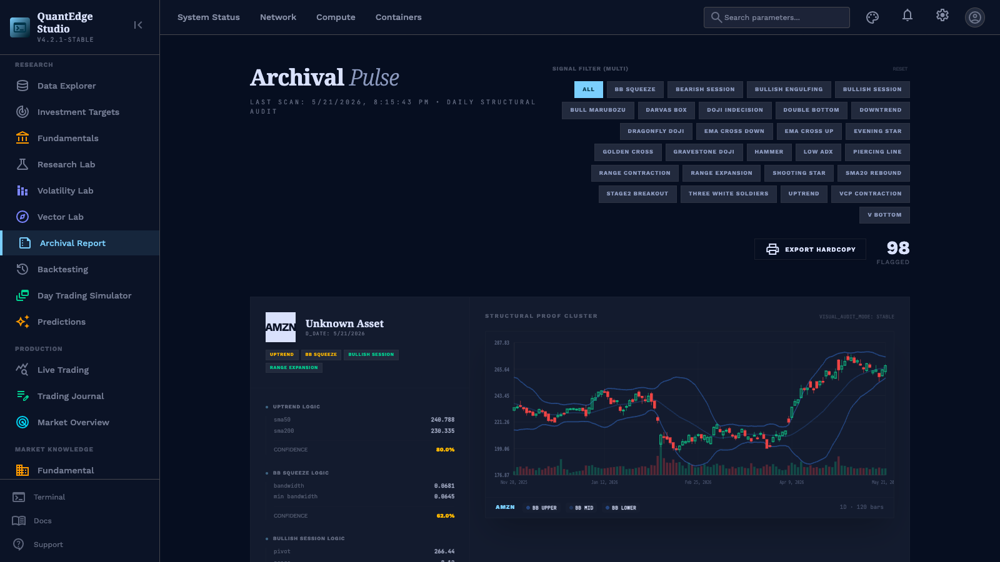

---

### ⏪ Backtesting Engine
A robust simulation environment for validating quantitative strategies against historical snapshots. Supports fractional execution, ATR-based slippage modeling, and ensemble-weighted performance auditing.

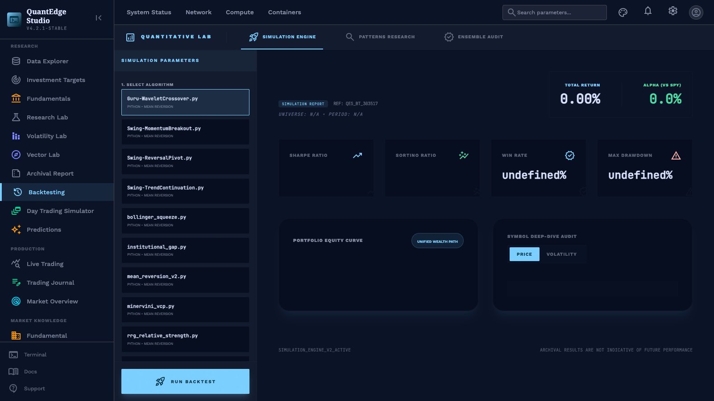

---

### 🎮 Day Trading Simulator
An immersive intraday simulation environment for practicing execution discipline on real historical data without financial risk.

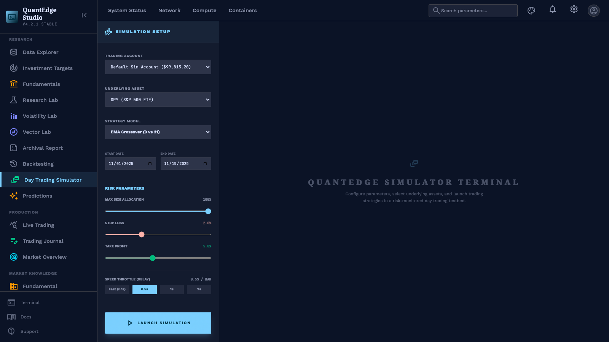

---

### 🔮 Predictions (Foundation Forecasts)
Surfaces forward-looking regime forecasts powered by **TimesFM** (Time Series Foundation Model) and HMM (Hidden Markov Models) to predict volatility regimes and price targets.

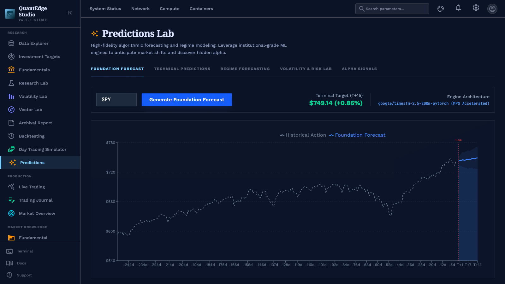

---

## 🚀 Production

### 📈 Live Trading & Ensemble Engine
High-conviction signal orchestration. Aggregates RSI Reversals, Pivot Points, and GEX Bias into a unified **Ensemble Score** for tactical execution decisions.

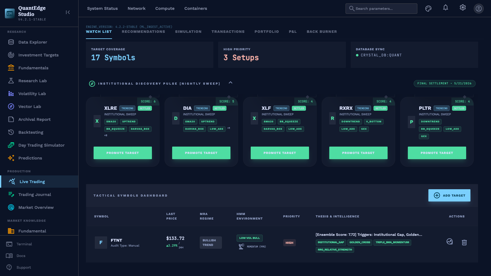

---

### 📓 Trading Journal (Cognitive Cockpit)
A structured pre-trade and post-trade journaling environment built around three panes:

| Pane | Purpose |
|------|---------|
| **Intent Canvas** | Craft a pre-trade flight plan — strategy selection, entry thesis, risk parameters |
| **Live Stream Workspace** | Monitor active positions, update execution notes in real time |
| **Feedback Loop** | Post-trade recap — rule adherence scoring, lessons learned, PnL journaling |

A horizontal **Flight Log tray** at the top shows all PLANNED / ACTIVE / CLOSED positions for the selected brokerage account.

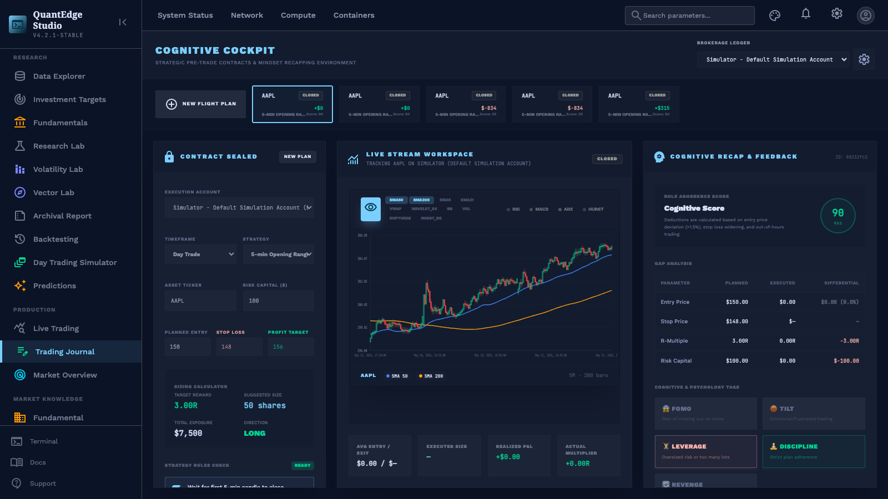

---

### 🌐 Market Overview (Pre-Market Radar)
A macro dashboard synthesizing the full pre-market environment. Organized sections:

| Section | Data |
|---------|------|
| **Index Futures** | ES · NQ · RTY with divergence alerts |
| **Volatility Complex** | VIX spot, term structure (F1/F2 contango/backwardation), DXY, Oil, Gold |
| **Rates & Yield Curve** | 10Y · 2Y treasuries, 10Y–2Y spread inversion alert |
| **SPY 0DTE Options Mechanics** | Net GEX, Call/Put walls, PCR ratios (OI & Volume) |
| **Upcoming Earnings** | Sorted by proximity, with market cap & sentiment badges |
| **Volume Anomalies** | Watchlist spikes vs. 15-day average |

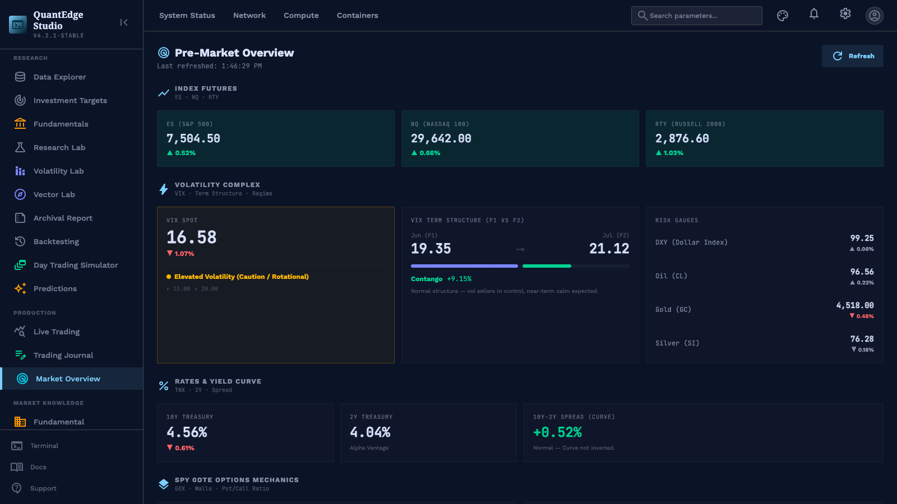

---

## 🧠 Market Knowledge Base

A markdown-powered wiki with a resizable file-explorer sidebar, full edit/publish workflow, and support for Mermaid diagrams, LaTeX math, and embedded images. Three categories:

### 🏛️ Fundamental Analysis
Corporate intelligence — valuation multiples, revenue growth trajectories, balance sheet strength.

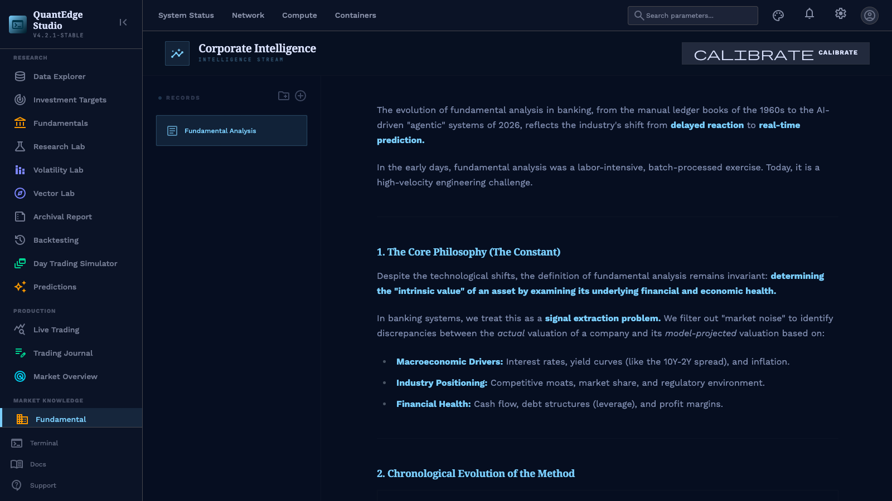

### 🕯️ Technical Archetypes
A comprehensive library of structural candle patterns and quantitative setups (VCP, Stage 2 Breakouts, Reversal Stars).

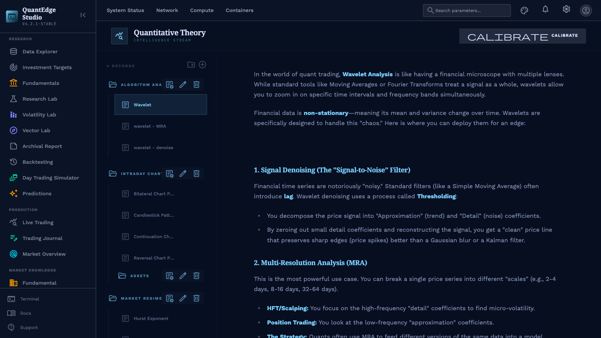

### 📰 News Intelligence
Real-time sentiment sensing and news flow archival to correlate institutional moves with narrative shifts.

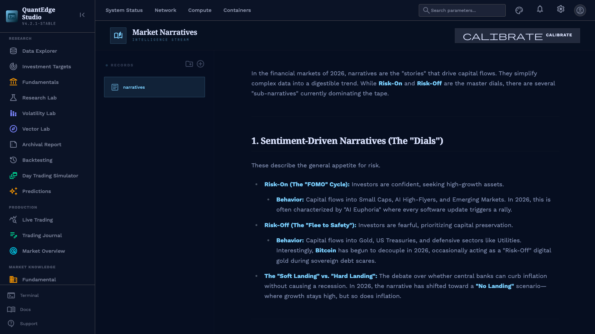

---

## 🛠️ Infrastructure & Governance

### 🟢 System Status
Health monitoring of the API, Frontend, and QuestDB ingestion kernels with per-service uptime and latency indicators.

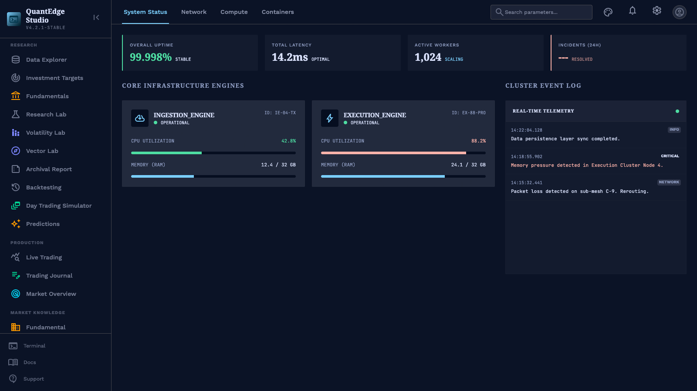

### 🕸️ Network Topology
Visualization of internal service mesh and external data provider connectivity.

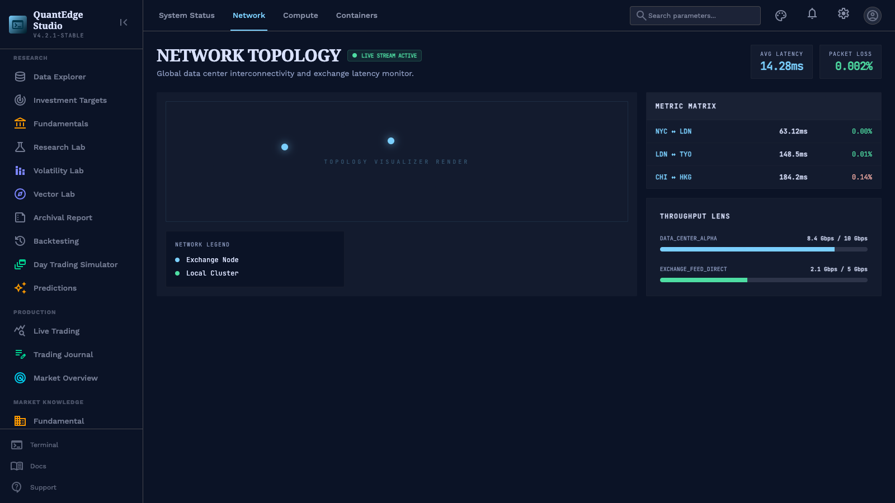

### 💻 Compute Allocation
Real-time telemetry on CPU/Memory utilization for the HMM and GEX enrichment engines.

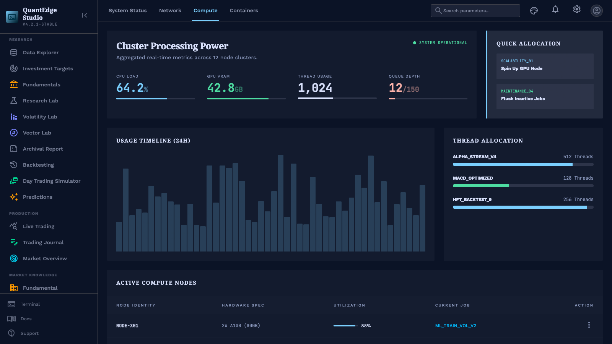

### 📦 Container Registry
Management interface for the Docker-orchestrated service stack (API, Worker, PostgreSQL, QuestDB).

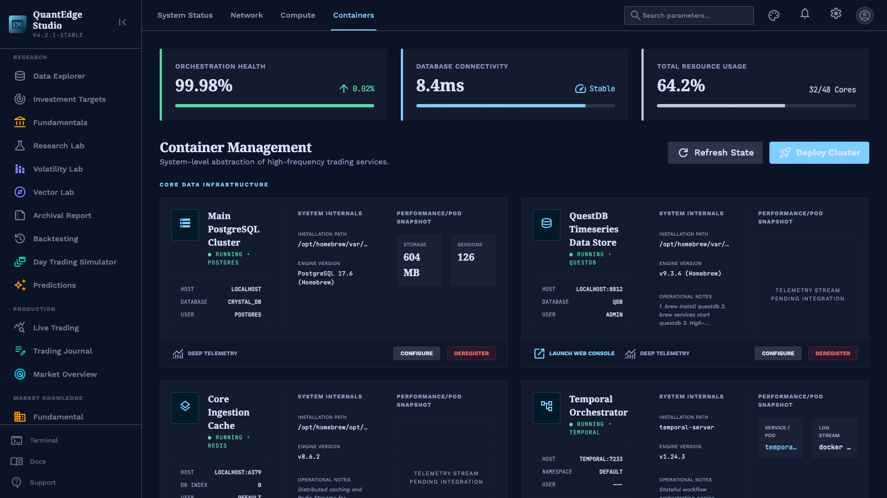

---

## 🏗️ Technical Architecture

QuantEdge Studio leverages a **Hexagonal "Port & Adapters" Architecture** to ensure quantitative logic remains decoupled from external data providers.

```
┌─────────────────────────────────────────────────────────────┐
│                     QuantEdge Studio                         │
│  Frontend: React / TypeScript / Tailwind CSS (Vite)          │
├─────────────────────────────────────────────────────────────┤
│  FastAPI Service Layer  ──►  Temporal.io Workflow Engine      │
├──────────────┬──────────────┬───────────────────────────────┤
│   DuckDB     │   QuestDB    │        PostgreSQL              │
│  (OLAP/OCC   │  (Time-Series│  (Relational: targets,         │
│   options)   │   OHLCV)     │   journal, strategies)         │
└──────────────┴──────────────┴───────────────────────────────┘
```

| Layer | Technology |
|-------|-----------|
| **Frontend** | React 18 · TypeScript · Tailwind CSS · Vite |
| **API** | FastAPI · Python 3.12 |
| **OLAP Research** | DuckDB (OCC options settlement) |
| **Time-Series** | QuestDB (OHLCV ingest) |
| **Relational** | PostgreSQL (targets, journal, strategies) |
| **Orchestration** | Temporal.io (fault-tolerant enrichment workflows) |
| **Containerization** | Docker Compose |

---

*QuantEdge Studio: Engineering Financial Conviction.*
