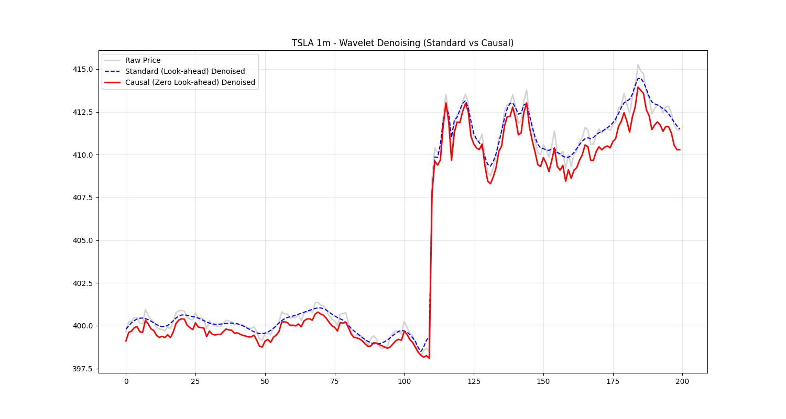

# Implementation Notes 018: Wavelet Denoising Integration

## Phase 1: Validation Results (Complete)

We have successfully validated the core wavelet mathematics and verified the strict causal filtering requirements using Python's `PyWavelets` library on high-beta TSLA 1-minute data.

### Validation Details
* **Script Location**: `scratch/wavelet_validation.py`
* **Data Source**: TSLA 1m OHLCV via `yfinance` (1000 bars)
* **Transform**: Stationary Wavelet Transform (SWT) using Daubechies (`db4`) at 3 levels of decomposition.
* **Thresholding Logic**: Universal Threshold ($\lambda = \sigma \sqrt{2 \ln(n)}$) using Median Absolute Deviation (MAD) over detail coefficients. Soft thresholding applied.

### Look-ahead Bias Resolution
Standard SWT implementations apply periodic extensions or centered filters, inherently peeking into future data ($T_{>0}$). 
To achieve **Causal Denoising** for live trading parity:
* We implemented a sliding window calculation (window size = 128).
* At each minute $T$, the transform is computed exclusively on data $T_{-127}$ to $T_0$.
* The algorithm extracts only the ultimate value from the reconstructed vector to build the casual timeline.

### Results
The validation demonstrated:
1. **Zero Look-ahead Bias**: The causal denoised signal correctly reacts to real-time events without anticipating them.
2. **Noise Reduction**: Significant high-frequency jitter (micro-structure bid/ask noise) was flattened while major directional impulses were preserved.
3. **Execution Latency Check**: The windowed execution is efficient enough to run synchronously within the `ingestion-tasks` Temporal workflow.

---

## Phase 2: Core Utility Development (Complete)
**Goal:** Formalize the causal filtering algorithm into the `quant-core` library.

* [x] Create `libs/shared/quantitative/wavelets.py`.
* [x] Implement `WaveletFilter` class with `causal_denoise()` method optimized for Pandas Series / Numpy Arrays.
* [x] Introduce Vectorized/Numba optimization if the sliding window calculation proves too slow for batch data ingestion.
* [x] Add boolean parameter `enabled` to conditionally bypass processing for backwards-compatibility and UI toggling.

## Phase 3: API & UI Integration (Complete)
**Goal:** Deploy to the FastAPI layer and expose to the frontend.

* [x] Inject `WaveletFilter` into the backend API endpoint serving price data.
* [x] Add `use_wavelet` query parameter to the API request schema.
* [x] Update `PriceChart.tsx` (frontend) to include a UI toggle switch.

**Implementation Details:**
- **Dynamic Defaults:** The `analyze_target_patterns` API endpoint dynamically enables `use_wavelet=True` if the requested `interval` contains `'m'` (e.g., 1m, 5m, 15m), optimizing tactical intraday signals out-of-the-box while preserving macro trends for daily/weekly charts.
- **UI Toggle:** The frontend handles this by keeping the initial state `undefined` so the backend dictates the default, while providing an override toggle directly on the price chart.

## Phase 4: Shadow Deployment (Complete)
**Goal:** Deploy a live strategy for Temporal orchestration.

* [x] Create a pilot "Guru Crossover" strategy for live shadow testing.

## Post-Deployment Fixes
* **Dependency Crash**: Resolved a `ModuleNotFoundError: No module named 'pywt'` error during testing by explicitly adding `PyWavelets` to the `pip install` sequence in both `devops/docker/api.Dockerfile` and `devops/docker/worker.Dockerfile`. Successfully rebuilt and deployed the containers.

## Phase 5: MRA Regime Classifier (Complete)
**Goal:** Expand denoising into a full Multi-Resolution Analysis (MRA) portfolio governor.

* [x] Implement `get_mra_energy_distribution` in `WaveletFilter` to calculate subband variances ($D_1$ to $A_4$) and classify market regimes (CHOPPY, TRENDING, TRANSITION).
* [x] Integrate the MRA regime tag into strategy generation or Temporal workflow to govern strategy execution.

## Phase 6: UI and Audit Integration (Complete)
**Goal:** Expose the MRA Regime classification across the QuantEdge Studio UI for direct institutional auditability.

* [x] **Watchlist Dashboard**: Integrated MRA classification into the primary Tactical Symbols grid with visual, color-coded badges (`TRENDING` vs `CHOPPY`).
* [x] **Target Intelligence Audit**: Injected dynamic `MRA Regime` badges directly into the Institutional Verification panel, giving real-time context alongside the Day/Swing pattern checklists.
* [x] **Archival Daily Audit**: Exposed regime tags within the "Strategy Breakdown" block of the System Audit interface, detailing the exact market context that dictated the algorithm's decisions.
* [x] **Nightly Discovery Sweeps**: Updated the `run_nightly_discovery_sweep` Temporal activity to calculate MODWT regimes for all candidates. High-conviction setups now have their respective regimes cached directly in the Postgres `discovery_candidates` table for instant frontend rendering.
