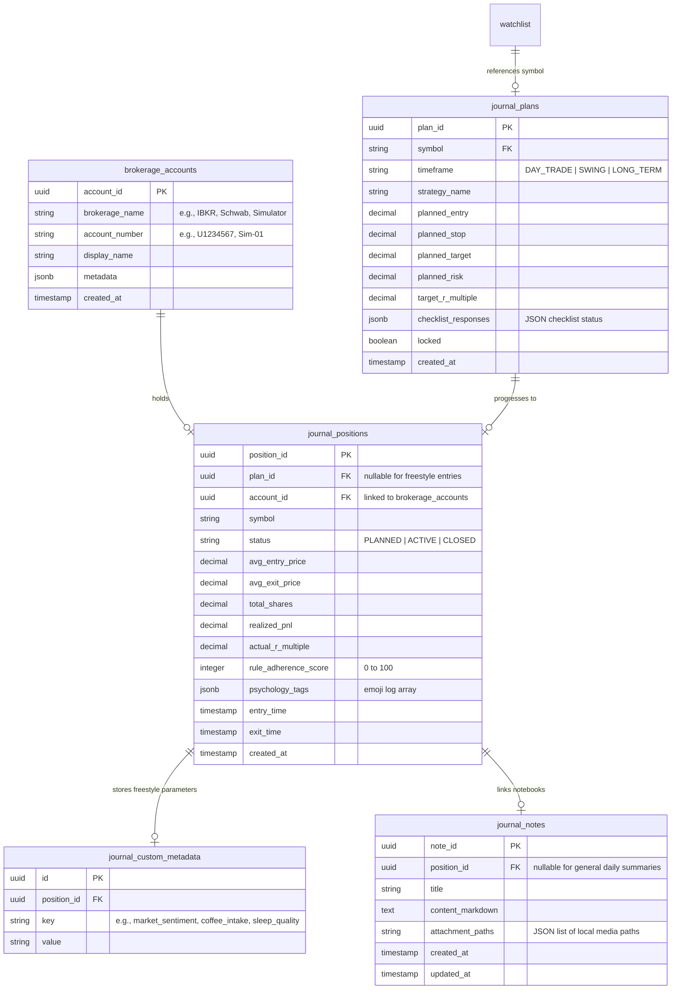

# 033 Cognitive Cockpit Trading Journal — Implementation Plan

## Status
- [x] V12 Postgres migration (`quant.brokerage_accounts`, `quant.journal_plans`, `quant.journal_positions`, `quant.journal_custom_metadata`, and `quant.journal_notes` tables)
- [x] V13 Postgres seed (`V13__seed_aapl_journal_sample.sql`) — full AAPL end-to-end demo sample
- [x] `apps/api/research/journal_api.py` — unified journal API router
- [x] Router registered in `apps/api/main.py`
- [x] `apps/frontend/src/services/api.ts` — journal API requests added
- [x] `apps/frontend/src/pages/Journal.tsx` — main dashboard cockpit UI
- [x] `apps/frontend/src/components/Journal/IntentCanvas.tsx` — Left pane (Intent Canvas)
- [x] `apps/frontend/src/components/Journal/LiveStreamWorkspace.tsx` — Center pane (Execution chart)
- [x] `apps/frontend/src/components/Journal/FeedbackLoop.tsx` — Right pane (Psychology and Gap Analysis)
- [x] `apps/frontend/src/components/Journal/AccountSettingsModal.tsx` — Brokerage Ledger settings modal (dynamic provider list)
- [x] Sidebar entry added under Production section
- [x] Route added in `apps/frontend/src/App.tsx`
- [x] Backend media upload handler added for notebook image attachment files
- [x] End-to-end verified: plans created, executions clustered, rule deviation alerts trigger correctly

---

## Implementation Details

### 1. Database Migration
**File:** `sql/postgres/migrations/V12__create_journal_tables.sql`
- Create `quant.brokerage_accounts` with a unique constraint on `(brokerage_name, account_number)`.
- Seed standard accounts (e.g., Default Sim).
- **V13 Demo Sample**: `V13__seed_aapl_journal_sample.sql` seeds a complete AAPL 5-min ORB trade walkthrough with deterministic UUIDs (plan `000...100`, position `000...200`, note `000...300`) using `ON CONFLICT DO NOTHING` guards so it is idempotent on re-runs.
- Create `quant.journal_plans` to store the target constraints, expected ranges, checklists, and locked status.
- Create `quant.journal_positions` with references to plans and accounts to log execution outcomes, realized P&L, actual R-multiples, and psychology emojis.
- Create `quant.journal_custom_metadata` to support freestyle metrics (Focus Level, Coffee, Catalyst) linked to the positions.
- Create `quant.journal_notes` to hold rich text/markdown notebook comments and file attachment paths.

#### Entity-Relationship Diagram

### 2. Backend Router
**File:** `apps/api/research/journal_api.py`
- **Account endpoints**: Fetch all accounts and register new broker accounts.
- **Plan endpoints**: Create and query pre-trade plans.
- **Position clustering**:
  - Load active positions from `quant.journal_positions`.
  - Cluster transaction execution legs from the simulator (`quant.simulation_trades`) or live logs (`quant.transactions`) to compute weighted metrics (shares, average entry, average exit, realized P&L, actual R-multiple).
- **Rule Adherence Evaluator**:
  - Implement rule checking comparing actual clustered position execution price vs planned entry range.
  - Implement rule checking for stop widening.
  - Check volatility hour limits (9:30 AM - 4:00 PM EST) for `DAY_TRADE` timeframes.
- **Media Upload**:
  - Define static folder location for uploads: `/Users/kepingbi/20260408/data/journal_media`.
  - Handle binary file uploads and return reference paths.

**File:** `apps/api/main.py`
- Include router: `app.include_router(journal_router, prefix="/api/v1/journal", tags=["Journal"])`
- Mount static media files at `/data/journal_media` for client rendering.

### 3. Frontend Integration
**File:** `apps/frontend/src/services/api.ts`
- Add functions:
  - `fetchJournalAccounts()`
  - `fetchJournalPositions()`
  - `createJournalPlan(plan)`
  - `lockJournalPlan(planId)`
  - `submitPositionRecap(positionId, recap)`
  - `uploadJournalMedia(file)`
  - `fetchJournalNotes()`
  - `saveJournalNote(note)`

**File:** `apps/frontend/src/App.tsx`
- Add route: `<Route path="journal" element={<Journal />} />`

**File:** `apps/frontend/src/components/Layout/Sidebar.tsx`
- Add navigation entry for "Trading Journal" under the Research group.

### 4. Component Implementation
**File:** `apps/frontend/src/pages/Journal.tsx`
- Tri-pane grid layout using CSS grid (`grid-cols-1 lg:grid-cols-12`).
- Sidebar/account filters.

**File:** `apps/frontend/src/components/Journal/IntentCanvas.tsx`
- Form fields for Symbol, Entry Range, Take Profit, Stop Loss, Risk Capital.
- Live R-multiple and Position Sizing estimations.
- Toggable checklist based on timeframe/strategy.

**File:** `apps/frontend/src/components/Journal/LiveStreamWorkspace.tsx`
- Connects to current simulator WebSocket for active simulation sessions.
- Pulls clustered trade leg transactions and visualizes entries/exits on the price timeline.
- Highlights with a pulsing Amber/Yellow border when execution drifts from pre-trade ranges.

**File:** `apps/frontend/src/components/Journal/FeedbackLoop.tsx`
- Gap analysis side-by-side card.
- Emoji selection tiles for psychology tags.
- Notebook rich editor with local file attachment dropzone.
- Standard custom fields (Coffee, Focus, Sleep, Catalyst).

---

## Testing & Validation

### API Verification
- Check database constraints using test scripts.
- Validate media upload saves binaries correctly to local folder.
- Verify clustered transaction calculations match mathematical expectations.

### Frontend Verification
- Open http://localhost:3100/journal.
- Create a Plan with specific rules, lock it, and confirm state locks in the database.
- Simulate or execute trades violating rules (e.g. entry deviations) and check if the Amber border triggers on Pane B.
- Recap the position with psychology tags, custom metadata, and comments, checking if the Rule Adherence Score registers correctly.
