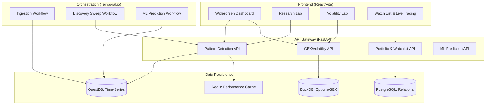
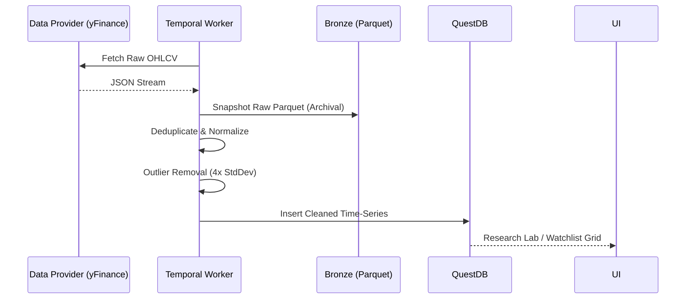
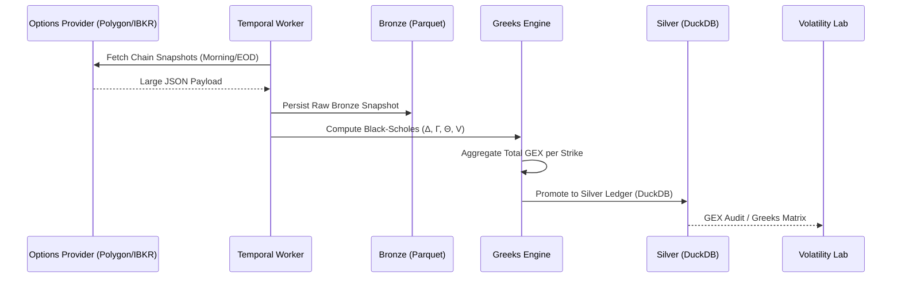
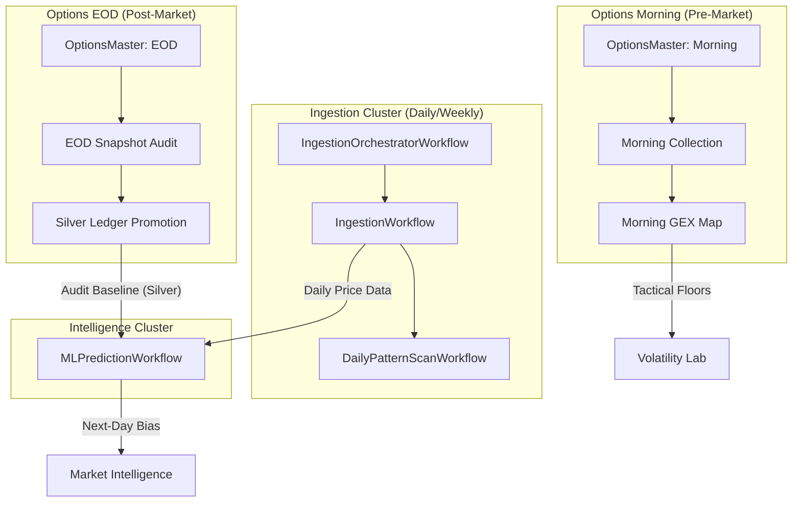

# QuantEdge Studio: Functional Architecture & System Flow

QuantEdge Studio is a multi-dimensional quantitative research and execution platform. It bridges the gap between raw market data and institutional-grade trading intelligence through high-fidelity diagnostic engines.

## 1. High-Level System Architecture

The following diagram illustrates the relationship between the core application layers and the data orchestration engine.

---

## 2. Core Functional Modules

### A. Research Lab (Pattern Detection Engine)
The **Research Lab** is the laboratory for structural technical analysis. It uses advanced mathematical models to segment market regimes.
- **Structural Auditing**: Scans for 20+ institutional patterns (VCP, Stage 2 Breakouts, Cup & Handle).
- **Regime Segmentation**: Uses the `ruptures` library (PELT algorithm) to identify structural shifts in volatility and trend.
- **Hurst Exponent**: Calculates persistence vs. anti-persistence to determine if a trend is likely to continue or mean-revert.
- **Strategy Index**: A library of Python-based trading strategies that can be audited against live data.

### B. Volatility Lab (GEX Command Center)
The **Volatility Lab** provides deep-tissue diagnostics of the options market.
- **GEX Profiling**: Visualizes Gamma clusters to identify institutional "floors" and "ceilings."
- **Greeks Matrix**: A 14-column real-time workbench calculating Delta, Gamma, Theta, and Vega.
- **Gamma Bias**: Detects supportive (Long Gamma) vs. accelerative (Short Gamma) market regimes.

### C. Watch List & Auto-Audit
This module transitions research into actionable trade monitoring.
- **Auto-Audit**: A synchronized institutional stress test that runs on-demand or nightly. It cross-references technical patterns with Relative Strength (RS) and Gamma Exposure (GEX).
- **Discovery Candidates**: A nightly market-wide sweep that surface symbols matching high-probability setups (e.g., "Ironclad" breakout).

### E. Market Knowledge (Research Management)
The **Market Knowledge** module serves as the platform's institutional memory, providing a centralized repository for technical analysis, chart patterns, and fundamental research.
- **Hierarchical Notes**: Organizes knowledge into primary categories: **Fundamental**, **Technical**, and **News**.
- **Collaborative Research**: Supports a clinical Markdown-based editing interface with real-time tree exploration.
- **Asset Integration**: Serves embedded media (images/diagrams) alongside research notes to create high-fidelity diagnostic reports.

---

## 3. Data & Processing Lifecycle

The platform follows a **"Clean Data First"** philosophy with a multi-layered promotion strategy (Bronze -> Silver).

### A. Core Equity Pipeline (Time-Series)
Focuses on technical patterns and price action.

### B. Options & Volatility Pipeline (Institutional)
Focuses on institutional positioning and risk. This runs in two distinct, time-sensitive cycles:

#### I. The Morning Cycle (Pre-Market Tactical)
- **Timing**: 08:30 - 09:15 NY.
- **Objective**: Establish the tactical "Gamma Map" before the opening bell.
- **Processing**: Fetches overnight chain updates to calculate the **GEX Floor** and **GEX Ceiling**.
- **Impact**: Provides the Volatility Lab with the expected support/resistance zones that market makers will defend during the session.

#### II. The EOD Cycle (Post-Market Audit)
- **Timing**: 16:15 - 17:00 NY.
- **Objective**: Perform the final institutional audit and update the long-term Silver Ledger.
- **Processing**: Promotes the final daily snapshot from Bronze to Silver (DuckDB), recalculates full-day Greeks, and triggers the ML feature-engineering suite.
- **Impact**: Sets the historical baseline used by the **Intelligent Prediction Module** to forecast next-day directional biases.

### D. Intelligent Prediction Module (ML Pipeline)
The **Intelligent Prediction Module** provides machine-learning-based forecasts of market movement, leveraging historical price action and institutional flow data.
- **Automated Inference**: Powered by the `MLPredictionWorkflow` in Temporal, which runs daily after the close (e.g., 16:45 NY).
- **Signal Generation**: Produces directional biases (Bullish/Bearish) and confidence scores based on ensemble models.
- **Roadmap**: This module is designated for heavy enhancement, including the integration of alternative data (GEX regimes, social sentiment) and deep-learning refinement.

---

## 4. Temporal Orchestration & Workflow Dependencies

The platform's reliability and data synchronization are managed by **Temporal.io**, ensuring idempotent execution and automatic recovery of long-running quantitative tasks.

- **Structural Parity**: The `DailyPatternScanWorkflow` depends on the `IngestionWorkflow` to ensure that indicators like SMA200 have a full 1000-bar history before signatures are matched.
- **Enrichment Convergence**: The `MLPredictionWorkflow` is the ultimate convergence point, waiting for both technical (Price) and institutional (GEX) data layers to be finalized in QuestDB and DuckDB.

---

## 5. Key Functional Phases

### I. The "Bronze" Layer (Data Hardening)
- **Morning Snapshot**: Captures overnight positioning and institutional delta-hedging needs before the open.
- **EOD Snapshot**: Captures final settlement positioning to build the "Gamma Bias" for the next session.
- **Immutability**: Raw data is never modified; it serves as the audit trail for regulatory and split-adjustment verification.

### II. The "Silver" Layer (Enrichment)
- **Black-Scholes Integration**: Real-time pricing of Greeks using spot price from QuestDB and interest rate models.
- **Gamma Summation**: Strikes are aggregated to find "Flip Zones" where market makers transition from supportive to accelerative hedging.
- **Liquidity Purging**: Removes "Ghost Strikes" (zero volume/open interest) to clean the institutional signal.

### III. The Prediction Layer (Intelligence)
- **Feature Engineering**: Automated generation of volatility and trend features from QuestDB.
- **Daily Persistence**: Predictions are stored with a timestamp and version ID to allow for historical accuracy auditing (Backtesting).

---

## 6. Storage Architecture & Persistence

The platform uses a tiered storage approach to balance archival durability with research performance.

### A. The Bronze Layer (Filesystem Archival)
- **Format**: Apache Parquet.
- **Location**: `/data/bronze/{YYYY-MM-DD}/`
- **Content**: Raw, immutable snapshots of option chains and market data. This layer is used for re-processing and historical split adjustments.

### B. The Silver Layer (DuckDB Performance Engine)
- **Format**: DuckDB Database (`.db`).
- **Location**: `/db/options_analytics.db`
- **Table**: `silver_options`
- **Content**: Enriched institutional-grade data including:
    - **Greeks**: Delta (Δ), Gamma (Γ), Theta (Θ), and Vega (V).
    - **GEX**: Dollar Gamma Exposure per strike (calculated as `OI * 100 * Gamma * Spot * Multiplier`).
    - **Context**: Normalized timestamps, expiration cycles, and underlying spot prices.

### C. The Time-Series Layer (QuestDB)
- **Format**: Columnar Time-Series.
- **Location**: QuestDB Container Volume.
- **Table**: `market_data`
- **Content**: Cleaned OHLCV data used for technical pattern recognition and indicator warmup (SMA/EMA).

### D. The Intelligence Layer (PostgreSQL)
- **Format**: Relational Table.
- **Table**: `daily_predictions`
- **Content**: Directional biases, confidence scores, and feature importance mappings for every audited symbol.

### E. The Knowledge Layer (Filesystem Markdown)
- **Format**: Markdown (.md) + Static Assets (Images).
- **Location**: `/data/knowledge/{category}/`
- **Categories**: `fundamental`, `technical`, `news`.
- **Content**: The ground-truth repository for qualitative research and institutional playbooks.

---

## 7. Key Performance Safeguards
- **NaN/Inf Resilience**: The API gateway includes atomic sanitization to prevent frontend crashes on invalid mathematical results.
- **Lookback Parity**: All audit engines use a standardized 1000-bar lookback to ensure "warmup" consistency for long-period moving averages.
- **Redis Convergence**: High-computation results (like Hurst or Ruptures) are cached in Redis to provide sub-second UI responsiveness.
