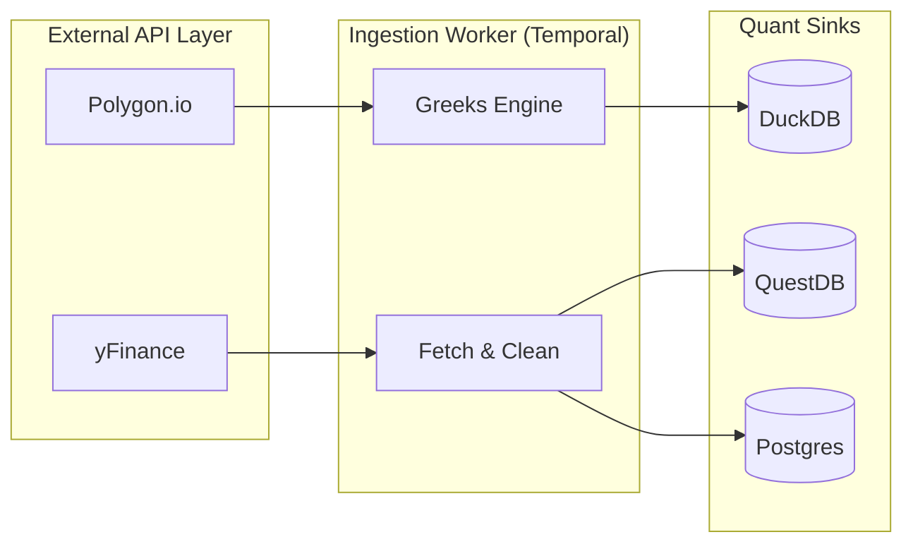

# QuantEdge Studio: Technical Specification

This document provides a deep dive into the engineering principles, architectural patterns, and technology stack that power the QuantEdge Studio.

## 1. Core Technology Stack

The system is built for low-latency analysis and resilient data orchestration.

| Layer | Technology | Role |
| :--- | :--- | :--- |
| **Frontend** | React 18, TypeScript, Vite | High-fidelity UI with TailwindCSS & HeadlessUI. |
| **API Gateway** | FastAPI (Python 3.11+) | Asynchronous gateway with atomic JSON sanitization. |
| **Orchestration** | Temporal.io | Idempotent workflow management and scheduling. |
| **Time-Series DB** | QuestDB | High-performance ingestion for OHLCV data. |
| **Analytical DB** | DuckDB | Institutional options ledger and GEX processing. |
| **Relational DB** | PostgreSQL | Persistence for targets, predictions, and metadata. |
| **Cache Layer** | Redis | Computation memoization and performance acceleration. |
| **Containerization**| Docker / Docker-Compose | Unified environment parity (Dev to Prod). |

---

## 2. Architectural Patterns

### A. Hexagonal Architecture (Ports & Adapters)
The backend is designed to be provider-agnostic. 
- **Domain Logic**: Pure Python functions for pattern detection and risk math.
- **Adapters**: Pluggable modules for data providers (Polygon, IBKR, yFinance) and database sinks.
- **Benefits**: Allows for rapid testing and swapping of data sources without touching core quantitative logic.

### B. "Clean Data First" (The 1000-Bar Standard)
To ensure technical indicator stability (especially long-period EMAs like the SMA200), the system enforces a strict **1000-bar trailing lookback** for all analytical triggers. This prevents "Indicator Drift" between the Research Lab and Live Trading.

### C. Atomic JSON Sanitization
Financial calculations frequently produce `NaN` (Not a Number) or `±Inf` (Infinity). The API layer uses a custom middleware to recursively sanitize all outgoing payloads, ensuring the frontend never crashes due to mathematical edge cases.

---

## 3. Data Flow & Networking

---

## 4. Quantitative Engines

### I. Structural Pattern Engine (`patterns.py`)
- **TA-Lib Integration**: Uses optimized C-bindings for standard indicators.
- **Custom Signatures**: Implementation of VCP (Volatility Contraction Pattern) and Stage 2 Breakout logic.
- **Intraday Gating**: Context-aware logic that prevents intraday patterns (like ORB) from appearing on daily/weekly frames.

### II. Volatility & GEX Engine (`enricher.py`)
- **Black-Scholes Model**: Real-time Greeks calculation with normalized time-to-expiry.
- **Dollar GEX**: Aggregate Gamma Exposure calculated as:
  $$GEX = OI \times 100 \times \text{Gamma} \times \text{Spot} \times \text{Multiplier}$$
- **Liquidity Filter**: Prunes strikes with >50% bid-ask spreads or extreme distance from spot to maintain signal purity.

### III. ML Prediction Engine
- **Ensemble Inference**: Combines technical features from QuestDB with institutional flow from DuckDB.
- **Temporal Scheduling**: Automated retraining and inference cycles ensuring daily "Next-Day" forecasts are ready before the pre-market session.
## 5. Scholar Ledger Markdown Engine

The documentation and knowledge systems utilize a custom-tuned Markdown engine designed for high-fidelity technical and quantitative reporting.

### I. Rendering Capabilities
- **GitHub Flavored Markdown (GFM)**: Full support for tables, task lists, and strikethrough via `remark-gfm`.
- **LaTeX Math Support**: Integrated `remark-math` and `rehype-katex` for institutional-grade mathematical rendering.
  - *Example*: $$ \sigma = \sqrt{\frac{1}{N} \sum_{i=1}^{N} (x_i - \mu)^2} $$
- **Dynamic Mermaid Diagrams**: Real-time rendering of flowcharts, sequence diagrams, and architecture maps using `mermaid.js`.

### II. Asset & Persistence Logic
- **Relative Asset Resolution**: A custom backend proxy (`/api/v1/docs/asset`) resolves local image paths within the documentation folder, ensuring images render correctly without absolute URL requirements.
- **Session Persistence**: The UI utilizes `localStorage` to track the "Last Opened" document independently for the Doc Index and each Market Knowledge category (Fundamental, Technical, News).
- **Prose Architecture**: Styled using Tailwind's Typography plugin with custom overrides for the "Scholar Ledger" aesthetic—prioritizing readability, code-block syntax highlighting, and responsive widescreen behavior.
