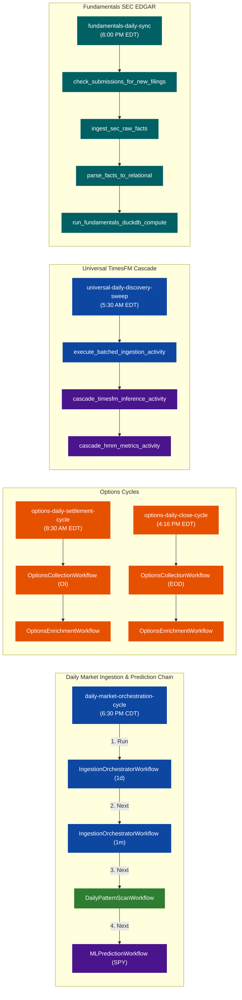

# Temporal Scheduled Tasks & Dependencies

This document provides a comprehensive map of the scheduled workflows registered in the Temporal system, including their cron runtimes, logical/child dependencies, and execution flows.

---

## 1. Dependency Graph (Mermaid)

The following Mermaid diagram visualizes the active pipeline structures. Solid arrows represent explicit child workflow execution cascades; dashed lines represent chronological/data dependencies (e.g., one workflow uses data ingested by another).

---

## 2. Schedule Registry Details

All times are displayed in **CDT (Central Daylight Time)** and **UTC** for operational clarity:

| Schedule ID | Workflow Class | Config / Args | Local Time (CDT) | UTC Time | Timezone Ref | Description |
| :--- | :--- | :--- | :--- | :--- | :--- | :--- |
| **`daily-market-orchestration-cycle`** | `DailyMarketOrchestratorWorkflow` | `{}` | `6:30 PM` (Mon-Fri) | `23:30` | `America/Chicago` | Unified daily sequential flow: 1d Ingestion $\rightarrow$ 1m Ingestion $\rightarrow$ Candlestick Pattern Scan $\rightarrow$ ML SPY Predictions. |
| **`options-daily-settlement-cycle`** | `OptionsMasterOrchestratorWorkflow` | `{"phase": "OI"}` | `7:30 AM` (Mon-Fri) | `12:30` | `America/New_York` | Morning Options collect & enrich cycle. |
| **`options-daily-close-cycle`** | `OptionsMasterOrchestratorWorkflow` | `{"phase": "EOD"}` | `3:16 PM` (Mon-Fri) | `20:16` | `America/New_York` | Afternoon EOD Options collect & enrich cycle. |
| **`universal-daily-discovery-sweep`** | `UniversalTimesFMSweepWorkflow` | `{}` | `4:30 AM` (Mon-Fri) | `09:30` | `America/New_York` | Stateful downloads + TimesFM + HMM cascade. |
| **`fundamentals-daily-sync`** | `FundamentalsIngestionWorkflow` | `{"mode": "daily_sync"}` | `5:00 PM` (Mon-Fri) | `22:00` | `America/New_York` | Lightweight SEC Edgar filing check & ELT sync. |
| **`ingestion-weekly-1w`** | `IngestionOrchestratorWorkflow` | `{"interval": "1w", "smart_fill": true}` | `5:00 AM` (Saturday) | `10:00` | `America/Chicago` | Weekly rollup ingestion for history. |
| **`nightly-discovery-sweep`** | `NightlyDiscoveryWorkflow` | `{}` | `9:30 PM` (Mon-Fri) | `02:30` | `UTC` (Direct spec) | Evening sweeps for long candidates. |

---

## 3. Operational Mechanics

### A. Consolidation & Rate-Limit Prevention
Rather than running data collection and processing on separate timer-based schedules (which risk overlapping and hitting yfinance/data provider rate limits), the daily ingestion and predictive runs are locked into a single chain:
* **`DailyMarketOrchestratorWorkflow`** triggers daily ingestion. Only when daily bars are saved does it start the minute bars.
* Once the minute bars finish, the database tables are stable, and the pattern detection engine starts.
* Once the pattern results are written, the ML model generates forecasts for SPY.
* This chain begins at **6:30 PM CDT** to guarantee that the trading day has settled and data is fully available from standard public endpoints.

### B. Options Pipeline Safety
The options tasks run via `OptionsMasterOrchestratorWorkflow` to ensure that raw contract collection completes and is validated (via sentinel files) before downstream calculations (GEX, IV) begin, avoiding corrupted Postgres or QuestDB tables.
