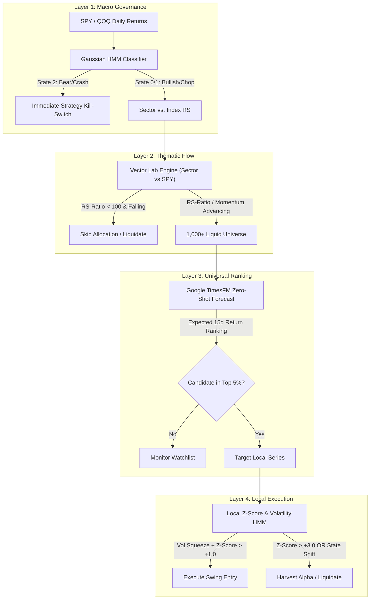

# Research Specification 025: Universal "One vs. All" Hierarchical Alpha Engine

**Author:** Antigravity (QuantEdge Studio)  
**Target Scope:** Global Institutional Symbol Universe (S&P 500 Core + Discovery Candidates)  
**Holding Horizon:** 3-Week Tactical Swing (15 Trading Sessions)  
**Status:** PRODUCTION SPECIFICATION  

---

## 1. Executive Summary & Universal Philosophy

To systematically surface top-tier breakout candidates ("the winners") across a diverse multi-asset universe, an algorithm must evaluate individual asset setups while remaining strictly bound to macroeconomic gravity. Standard ranking routines fail by attempting to treat defensive large-cap staples and explosive infrastructure proxies with identical localized parameters, causing heavy drawdowns during sector rotations or broad market de-risking cycles.

The **Universal "One vs. All" Hierarchical Engine** resolves this by stacking unified global macroeconomic and thematic gating filters on top of localized, beta-adjusted execution models. This guarantees that capital is deployed exclusively into structurally sound assets operating within advancing sectors that rank at the absolute apex of the cross-sectional Expected Value distribution.



---

## 2. Layer-by-Layer Mathematical Formulation

### Layer 1: Market Regime Architecture (Global Circuit Breaker)
> [!IMPORTANT]  
> During systemic de-risking, cross-asset correlation approaches 1.0. Layer 1 completely overrides local setups to preserve capital across all target tiers.

*   **Ingestion Feed:** 5-Year rolling window of daily log returns for the core benchmark index.
*   **Engine:** 3-State **Gaussian Hidden Markov Model (HMM)**.
*   **State Classifications:**
    *   **State 0 (Systemic Bull):** Low realized variance, positive mean return drift. **Action: Uncapped Allocation.**
    *   **State 1 (Sideways Volatility):** Elevated variance, zero mean drift. **Action: Reduced Sizing / Tighter Trailing Stops.**
    *   **State 2 (Structural Bear/De-risking):** Extreme tail variance, negative mean drift. **Action: Absolute Kill-Switch (Zero Exposure).**

### Layer 2: Sector/Theme Vector Mapping (Global Flow)
> [!NOTE]  
> Instead of raw simple ratios or conventional RSI indicators, we interface directly with the **QuantEdge Vector Lab (RRG)** mathematical engine to evaluate thematic demand velocity.

*   **Ingestion Feed:** Daily closes of the candidate's primary assigned sector ETF versus the benchmark index.
*   **Normalization Pipeline:**
    $$\text{RS-Raw} = \frac{\text{Sector}_{\text{close}}}{\text{Benchmark}_{\text{close}}}$$
    $$\text{RS-Ratio} = 100 + \left( \frac{\text{RS-Raw} - \mu_{\text{rolling}}}{\sigma_{\text{rolling}}} \right) \times 1.5$$
*   **Gating Condition:** The target sector must possess an advancing RS-Ratio slope over a 20-period moving average, confirming active capital rotation into the thematic framework.

### Layer 3: Foundation Model Selection (Universal Forward Ranking)
> [!TIP]  
> Pure chart analysis fails to capture multi-asset structural patterns. We utilize pre-trained foundational inference to rank candidate alpha profiles globally.

*   **Target Scope:** Comprehensive universe of highly liquid equities.
*   **Engine Layer:** **Google TimesFM** deployed in zero-shot inference mode.
*   **Inference Objective:** Forward 15-day cumulative expected return trajectories:
    $$\text{Cross-Sectional EV} = \frac{\text{Predicted Close}_{t+15} - \text{Current Anchor}}{\text{Current Anchor}}$$
*   **Conviction Threshold:** Candidates must achieve a predicted return ranking within the **Top 5%** of the cross-sectional universe to validate execution setups.

### Layer 4: Intraday & Tactical Calibration (Local Trigger)
> [!WARNING]  
> High-beta growth equities exhibit non-normal distributions. Standard mean-reversion logic interprets a $+2.0$ Z-score as overbought, whereas it frequently represents the ignition phase of a structural kinetic expansion.

*   **Execution Baseline Anchor:** Configurable via execution flags (`anchor_metric='VWAP' | 'CLOSE'`). Both series are fully supported, with **`VWAP`** configured as the mandatory production default to ensure execution respects intraday institutional accumulation.
*   **Execution Metrics:**
    *   **Local Volatility State:** Evaluated via an asset-specific 2-State HMM to detect "Volatility Squeezes" (low localized dispersion preceding kinetic expansion).
    *   **Dynamic Z-Score:** Calculated using the designated baseline anchor against a 20-period exponential baseline.
*   **Tactical Execution Matrix:**
    *   **Entry Authorization:** Triggered when the candidate transitions from a Volatility Squeeze into a volume-supported breakout where the baseline anchor's Local Z-score crosses above **$+1.0$**.
    *   **Exit / Liquidation Triggers:** 
        1.  *Statistical Exhaustion:* Local Z-score breaches **$+3.0$** (capturing peak kinetic extension).
        2.  *Regime Collapse:* Local HMM detects an internal pivot to high-volatility negative drift.
        3.  *Temporal Expiration:* Absolute liquidation at the close of the 15th active trading session.

---

## 3. Comprehensive Implementation Architecture

| Layer Function | Primary Processing Tier | Mathematical Engine | Target Execution Logic | Operational Latency |
| :--- | :--- | :--- | :--- | :--- |
| **L1: Systemic Safety** | Broad Benchmark | Gaussian HMM (3-State) | Gated Authorization | Post-Close Settlement |
| **L2: Thematic Inflow** | Primary Sector Proxy | Z-Score RS Normalization | Confirmed Vector Rotation | Real-Time Live Sweep |
| **L3: Conviction Rank** | S&P 500 Global Pool | Google TimesFM Forecast | Top 5% Cross-Sectional EV | Pre-Market Batch Sync |
| **L4: Kinetic Entry** | Candidate Ticker | Local HMM + Exponential Z | Breakout ($Z > +1.0$) on Vol | Live Intraday Streaming |

---

## 4. Operational Ingestion & Data Caching Policy

### 4.1 Fundamental Universe Mapping via Alpha Vantage
To compile and maintain candidate metadata without manual pre-filtering, the operational layer queries the **Alpha Vantage `OVERVIEW`** REST endpoint during scheduling passes:
* **Beta Screening**: Directly caches asset Beta values to dynamically map target volatility profiles.
* **Supply Boundaries**: Compiles floating shares outstanding and market capitalization to enforce programmatic liquidity floors.

### 4.2 Incremental Time-Series Caching in QuestDB
To eliminate live computation delays without sacrificing stateful analytical tracking, Layer 3 model metrics are structured for incremental persistence inside **QuestDB**:

#### Relational Source of Truth (`quant.sp500_symbol`)
To verify that Layer 4 candidate gating maps strictly against the true top 5% of the authentic macroeconomic distribution, the engine tracks all valid index constituents in a parallel PostgreSQL table seeded automatically from public index distributions:
```sql
CREATE TABLE IF NOT EXISTS quant.sp500_symbol (
    symbol VARCHAR(10) PRIMARY KEY,
    company_name VARCHAR(100),
    sector VARCHAR(50),
    added_at TIMESTAMP DEFAULT CURRENT_TIMESTAMP
);
```
* **Storage Decoupling**: Global historical sequences are appended exclusively to a separate QuestDB time-series ledger (`sp500_daily_bars`). This eliminates table scan overhead for existing targeted research tasks.
* **Stateful Cold-Start vs. Delta Ingestion Routing**: To optimize bandwidth and bypass rate barriers, the pipeline dynamically adjusts its API signature by checking QuestDB's internal coverage state. Tickers are bundled into vectorized **50-symbol sub-arrays**:
```python
# Check local database sequence state to optimize request sizes dynamically
is_cold_start = local_record_count < 20  

# Execute deep network sweeps strictly on initialization; otherwise pull lightweight incremental delta bars
fetch_period = "5y" if is_cold_start else "2d"
batch_data = yf.download(batch_50_symbols, period=fetch_period, interval="1d", group_by="ticker", threads=True)
```
* **Strict Gap-Prevention Resilience Hook**: To guarantee uninterrupted historical sequences, if an individual 50-symbol sub-array download experiences gateway timeouts or payload omissions, the worker intercepts execution before DB commitment. It executes an automated **single-pass fallback sweep** with exponential backoff (`sleep(2.0)`). If the fallback fetch succeeds, data is reconciled inline to prevent any permanent sequence gaps before proceeding.
* **Immediate Cascading Inference**: The precise millisecond the incremental daily download commits to `sp500_daily_bars`, the pipeline cascades execution directly into the TimesFM inference layer. The foundation model evaluates all updated sequences, sorts the cross-sectional Expected Value returns, and immediately commits the final ranking arrays to the dedicated tracking ledger **`timesfm_metrics`**:
```sql
-- Resolves the final ranking index instantly for live Layer 4 validation gating
SELECT symbol, expected_return, rank_index FROM timesfm_metrics LATEST ON timestamp PARTITION BY symbol;
```

---

## 5. Client Interface Layer & Dashboard Integration

To provide full observability over cross-asset signal gating, the Universal Alpha Engine surfaces as a premium top-level operational tier inside the **Live Trading Platform** (`UniversalAlphaEngineTab.tsx`):
* **Parallel Tab Hierarchy**: Operates side-by-side with the classic Recommendations tab to separate standalone single-stock ensemble pulses from global cross-sectional discovery funnels.
* **Granular Observability State**: Real-time visual metrics render inline validation results for the **4 Gateways**: mapping systemic safety states, RS-Ratio flow charts, sorted forward Expected Value arrays, and anchor breakout parameters.
* **Interactive Controls**: Users can interactively toggle execution anchors (`VWAP` vs `CLOSE`), simulate macro override blocks (State 2 Kill-Switch testing), and dispatch manual batch delta sweeps inline.
