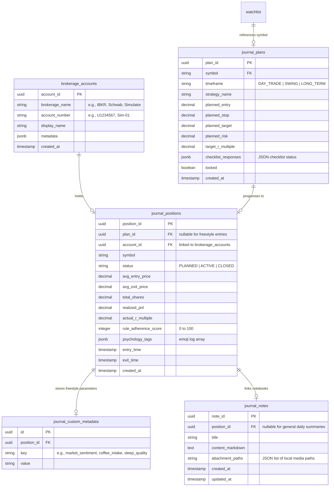

# 033 Cognitive Cockpit Trading Journal — Design Specification

## Objective

Build a professional-grade, low-latency, and high-feedback trading journal dashboard: **The Cognitive Cockpit**. The page serves as a unified checklist and process-optimization workspace for trading plan creation, execution capture, exit tracking, and post-trade recap analysis. It supports day trading, swing trading, and long-term investing, serving both rules-based strict strategies and freestyle trading, and integrates directly with the existing Day Trading Simulator and PostgreSQL brokerage transactions.

---

## 1. Core UI Architecture: "The Cognitive Cockpit"

The interface uses a **tri-pane responsive grid** designed to minimize cognitive load, allowing the trader to transition seamlessly between execution, analysis, and reflection.

```
┌─────────────────────────────────────────────────────────────────────────────────┐
│                           Cognitive Cockpit Header                              │
│   Account: [ Schwab - Main ▼ ]   Timeframe: [ Swing ▼ ]   Strategy: [ Freestyle ▼ ] │
├─────────────────────────┬──────────────────────────────┬────────────────────────┤
│                         │                              │                        │
│        PANE A           │            PANE B            │         PANE C         │
│   "INTENT" CANVAS       │   "LIVE STREAM" WORKSPACE    │    "FEEDBACK" LOOP     │
│                         │                              │                        │
│  • Strategy Form        │  • Real-Time Chart (WASM/SVG)│  • Adherence Score     │
│  • Entry/Stop Targets   │  • Trade Leg Plots (Ticks)   │  • Gap Analysis Table  │
│  • Position Sizing Calc │  • Real-Time Active P&L      │  • Psychology Tiles    │
│  • Strict Checklist     │  • Volatility Guardrails     │  • Markdown Notebook   │
│  • Plan Lock Button     │  • Yellow Alert Border       │  • Local Media Upload  │
│                         │                              │                        │
└─────────────────────────┴──────────────────────────────┴────────────────────────┘
```

### 1.1 Pane A: The "Intent" Canvas (Left)
* **Purpose**: Enforce process discipline by forcing the user to define their thesis *before* entering a trade.
* **Layout & Form Fields**:
  * **Brokerage & Account Selectors**: Selects active brokerage and sub-account (e.g., `Simulator - Sim-01`, `Fidelity - IRA`).
  * **Timeframe**: `Day Trade` | `Swing` | `Long Term` (adjusts default check lists and validation parameters).
  * **Strategy Select**: Selects standard templates (e.g., `5-min Opening Range Breakout`, `Mean Reversion`, `Gamma Neutral Arbitrage`) or `Freestyle`.
  * **Core Thesis Form**:
    * Target Symbol (e.g., `AAPL`)
    * Planned Entry Price / Entry Range (Min-Max)
    * Planned Stop Loss
    * Planned Take Profit
    * Risk Capital ($) (defaults to 1% of selected account balance)
  * **Automatic Metrics**:
    * **R-Multiple Expectancy**: Calculated dynamically as:
      $$\text{Target R-Multiple} = \frac{\text{Take Profit} - \text{Entry}}{\text{Entry} - \text{Stop Loss}}$$
    * **Position Size Calculator**: Suggests size based on risk and distance to stop:
      $$\text{Suggested Shares} = \frac{\text{Risk Capital}}{\text{Entry} - \text{Stop Loss}}$$
  * **Checklist Interface**: Displays checklists depending on the chosen strategy (e.g., for Day Trade: "Volatility index check", "Inside first 30-min candle", "Daily volume ratio > 1.2").
  * **Plan Action**: "Lock Thesis & Plan" button. Once clicked, the plan is locked in Postgres, establishing the contract baseline.

### 1.2 Pane B: The "Live Stream" Workspace (Center)
* **Purpose**: Real-time position tracking and visual execution enforcement.
* **Integrations**:
  * **Simulated Session stream**: Subscribes to the active simulator session WebSocket, plotting tick data.
  * **Transaction Leg Clustering**: Aggregates all transaction fills (buy/sell orders) for the selected account and symbol. It clusters individual executions (scaling in/out) into a single unified position object, displaying weighted average entry, current size, and realized/unrealized P&L.
* **Visual Guardrails (Yellow Warning Border)**:
  * A glowing amber border flashes around the workspace if:
    * The active entry price drifts $>1.5\%$ from the planned entry range.
    * An order is executed without a locked plan for that symbol.
    * The stop-loss level in the execution engine is moved further away than the planned stop loss.
    * Day trading occurs outside market hours (9:30 AM - 4:00 PM EST) without the "freestyle hours override" toggled.

### 1.3 Pane C: The "Feedback Loop" (Right)
* **Purpose**: Process optimization, emotional self-regulation, and AI-driven quantitative feedback.
* **Gap Analysis**: Computes the variance between the *Original Contract* (Pane A) and the *Actual Execution* (Pane B) in entry price, position size, and final exit price.
* **Rule Adherence Score (RAS)**:
  * A score from 0 to 100 based on rules met. If the score is $<100$, the interface displays a **Discipline Review Prompt** that blocks submission of the daily journal entry until the user writes an explanation for the rule drift.
* **Psychology Tiles**:
  * Employs interactive emoji tiles for behavioral tagging (e.g., 🥵 FOMO, 🤬 Tilt, 🤑 Greed, 🧘 Patience, 🚀 Discipline, 🌀 Revenge Trading).
* **Freestyle Notebook**:
  * Markdown-enabled editor allowing rich notes linked to the trade position.
  * Supports local drag-and-drop file/image uploads for screenshots, saved in the application data directory (`data/journal_media`).
  * Features a **Pre-Populated Metadata Form**:
    * Focus Level (1-5)
    * Coffee/Caffeine Intake (Low, Medium, High, None)
    * Sleep Quality (1-5)
    * Market Sentiment (Bullish, Bearish, Neutral)
    * Catalyst Type (Earnings, Technical Breakout, News, Trend Following)

### 1.4 Brokerage Account Settings Modal
* **Purpose**: Provide a self-service management interface to add, list, and modify brokerage accounts directly within the Cognitive Cockpit, eliminating manual database seeding.
* **UI Trigger**: A settings gear icon (using `settings` Google Material Symbols font) placed adjacent to the **Brokerage Ledger** selector in the page sub-header.
* **Layout & Controls**:
  * **Header**: Glassmorphic overlay card (`backdrop-blur-md bg-surface-container/90`) titled "Brokerage Ledger Configurations".
  * **Account Management Grid**:
    * **Left Panel - Existing Accounts**: A scrollable vertical card list showing display names, account numbers, and brokerage providers (e.g. Schwab, IBKR, Simulator) with tag styling matching their status.
    * **Right Panel - Create Account Form**: Form controls to add new entries:
      * **Brokerage Provider Selector**: Dropdown dynamically populated from presets (`Simulator`, `Fidelity`) and all brokerage names found in existing accounts, ending with a custom text field override.
      * **Account Number**: Validation pattern-checked string input.
      * **Display Name**: Friendly name for quick drop-down identification.
      * **Action Buttons**: "Register Account" (seals ledger) and "Close".
  * **State Synchronization**: Saving updates the ledger state in `Journal.tsx` and automatically selects the newly created account.

---

## 2. Database Schema (PostgreSQL)

The database migration resides in `sql/postgres/migrations/V12__create_journal_tables.sql`.

### 2.1 Entity-Relationship Diagram


### 2.2 DDL Specifications
```
-- 1. Brokerage Accounts
CREATE TABLE IF NOT EXISTS quant.brokerage_accounts (
    account_id UUID PRIMARY KEY DEFAULT gen_random_uuid(),
    brokerage_name TEXT NOT NULL,         -- e.g., 'Simulator', 'Schwab', 'Interactive Brokers'
    account_number TEXT NOT NULL,         -- e.g., 'Sim-01', 'U1234567'
    display_name TEXT NOT NULL,
    metadata JSONB DEFAULT '{}'::jsonb,
    created_at TIMESTAMP WITH TIME ZONE DEFAULT CURRENT_TIMESTAMP,
    UNIQUE (brokerage_name, account_number)
);

-- Seed default accounts
INSERT INTO quant.brokerage_accounts (account_id, brokerage_name, account_number, display_name)
VALUES 
    ('00000000-0000-0000-0000-000000000001', 'Simulator', 'Default-Sim', 'Default Simulation Account')
ON CONFLICT (brokerage_name, account_number) DO NOTHING;

-- 2. Journal Pre-Trade Plans
CREATE TABLE IF NOT EXISTS quant.journal_plans (
    plan_id UUID PRIMARY KEY DEFAULT gen_random_uuid(),
    symbol TEXT NOT NULL,
    timeframe TEXT NOT NULL,             -- 'DAY_TRADE', 'SWING', 'LONG_TERM'
    strategy_name TEXT NOT NULL,          -- '5-min ORB', 'Mean Reversion', 'Freestyle', etc.
    planned_entry DECIMAL NOT NULL,
    planned_stop DECIMAL NOT NULL,
    planned_target DECIMAL NOT NULL,
    planned_risk DECIMAL NOT NULL,
    target_r_multiple DECIMAL NOT NULL,
    checklist_responses JSONB DEFAULT '{}'::jsonb,
    locked BOOLEAN NOT NULL DEFAULT FALSE,
    created_at TIMESTAMP WITH TIME ZONE DEFAULT CURRENT_TIMESTAMP,
    updated_at TIMESTAMP WITH TIME ZONE DEFAULT CURRENT_TIMESTAMP
);

-- 3. Journal Positions
CREATE TABLE IF NOT EXISTS quant.journal_positions (
    position_id UUID PRIMARY KEY DEFAULT gen_random_uuid(),
    plan_id UUID REFERENCES quant.journal_plans(plan_id) ON DELETE SET NULL,
    account_id UUID NOT NULL REFERENCES quant.brokerage_accounts(account_id) ON DELETE CASCADE,
    symbol TEXT NOT NULL,
    status TEXT NOT NULL DEFAULT 'PLANNED', -- 'PLANNED', 'ACTIVE', 'CLOSED'
    avg_entry_price DECIMAL,
    avg_exit_price DECIMAL,
    total_shares DECIMAL DEFAULT 0,
    realized_pnl DECIMAL DEFAULT 0,
    actual_r_multiple DECIMAL DEFAULT 0,
    rule_adherence_score INT DEFAULT 100,
    psychology_tags JSONB DEFAULT '[]'::jsonb, -- Array of emoji strings
    entry_time TIMESTAMP WITH TIME ZONE,
    exit_time TIMESTAMP WITH TIME ZONE,
    created_at TIMESTAMP WITH TIME ZONE DEFAULT CURRENT_TIMESTAMP,
    updated_at TIMESTAMP WITH TIME ZONE DEFAULT CURRENT_TIMESTAMP
);

-- 4. Custom Metadata Fields (Freestyle flexibility layer)
CREATE TABLE IF NOT EXISTS quant.journal_custom_metadata (
    id UUID PRIMARY KEY DEFAULT gen_random_uuid(),
    position_id UUID NOT NULL REFERENCES quant.journal_positions(position_id) ON DELETE CASCADE,
    key TEXT NOT NULL,                   -- e.g., 'coffee_intake', 'market_sentiment'
    value TEXT NOT NULL,
    created_at TIMESTAMP WITH TIME ZONE DEFAULT CURRENT_TIMESTAMP,
    UNIQUE (position_id, key)
);

-- 5. Notebook Entries / Markdown summaries
CREATE TABLE IF NOT EXISTS quant.journal_notes (
    note_id UUID PRIMARY KEY DEFAULT gen_random_uuid(),
    position_id UUID REFERENCES quant.journal_positions(position_id) ON DELETE CASCADE,
    title TEXT NOT NULL,
    content_markdown TEXT NOT NULL,
    attachment_paths JSONB DEFAULT '[]'::jsonb, -- JSON string list of local paths
    created_at TIMESTAMP WITH TIME ZONE DEFAULT CURRENT_TIMESTAMP,
    updated_at TIMESTAMP WITH TIME ZONE DEFAULT CURRENT_TIMESTAMP
);
```

---

## 3. Backend API Specification

Exposed under `/api/v1/journal` in the FastAPI application:

### 3.1 Brokerage Accounts Management
* **`GET /api/v1/journal/accounts`**
  * *Response*: List of registered brokerage accounts.
* **`POST /api/v1/journal/accounts`**
  * *Request*: `{ brokerage_name, account_number, display_name }`
  * *Response*: UUID of the created account.

### 3.2 Pre-Trade Plans & Strategy Checklists
* **`GET /api/v1/journal/strategies`**
  * *Response*: Pre-configured strategy checklist structures (e.g. ORB, Mean Reversion).
* **`POST /api/v1/journal/plans`**
  * *Request*: `{ symbol, timeframe, strategy_name, planned_entry, planned_stop, planned_target, planned_risk, checklist_responses }`
  * *Response*: Created plan object + locked status.
* **`PATCH /api/v1/journal/plans/{plan_id}/lock`**
  * *Response*: `{ "status": "success", "locked": true }`

### 3.3 Journal Position Aggregations & Recaps
* **`GET /api/v1/journal/positions`**
  * *Query Params*: `account_id` (optional), `status` (optional)
  * *Response*: Aggregated positions (integrating simulator trades or `quant.transactions` legs).
* **`POST /api/v1/journal/positions/{position_id}/recap`**
  * *Request*: `{ rule_adherence_score, psychology_tags, custom_metadata, discipline_notes }`
  * *Response*: Status success.

### 3.4 Notebook & Markdown Notes
* **`GET /api/v1/journal/notes`**
  * *Response*: Notebook summaries.
* **`POST /api/v1/journal/notes`**
  * *Request*: `{ position_id, title, content_markdown, attachment_paths }`
* **`POST /api/v1/journal/upload-media`**
  * *Form-Data*: Binary file upload.
  * *Response*: `{ "url": "/api/v1/journal/media/filename.png" }`

---

## 4. Guardrail Validation Logic

The backend router will execute validation rules comparing executions against plans:

1. **Drift Check**:
   $$\text{Drift} = \frac{|\text{Actual Entry} - \text{Planned Entry}|}{\text{Planned Entry}}$$
   If $\text{Drift} > 0.015$, RAS is penalized by 25 points.
2. **Stop Move Check**:
   If actual stop triggered is wider than planned stop loss:
   $$\text{Stop Loss Widened} \rightarrow \text{RAS penalized by 40 points}$$
3. **Volatility Hour Check**:
   If timeframe is `DAY_TRADE`, strategy is rules-based, and execution occurred outside 9:30 AM - 4:00 PM EST:
   $$\text{Outside Hours} \rightarrow \text{RAS penalized by 20 points (unless overridden by Freestyle Hours checkbox)}$$

---

## 5. File Manifest

The implementation phase will cover:
* `sql/postgres/migrations/V12__create_journal_tables.sql` (Database structures)
* `sql/postgres/migrations/V13__seed_aapl_journal_sample.sql` (Full AAPL demo seed: plan → position → metadata → recap note)
* `apps/api/research/journal_api.py` (FastAPI router)
* `apps/api/main.py` (FastAPI router registration)
* `apps/frontend/src/pages/Journal.tsx` (Main Tri-Pane React dashboard)
* `apps/frontend/src/components/Journal/IntentCanvas.tsx` (Left canvas pane)
* `apps/frontend/src/components/Journal/LiveStreamWorkspace.tsx` (Center active chart pane)
* `apps/frontend/src/components/Journal/FeedbackLoop.tsx` (Right feedback, psychology, metadata pane)
* `apps/frontend/src/services/api.ts` (API Client integrations)
* `apps/frontend/src/components/Layout/Sidebar.tsx` (Navigation sidebar registration)
* `apps/frontend/src/App.tsx` (React routing configuration)
